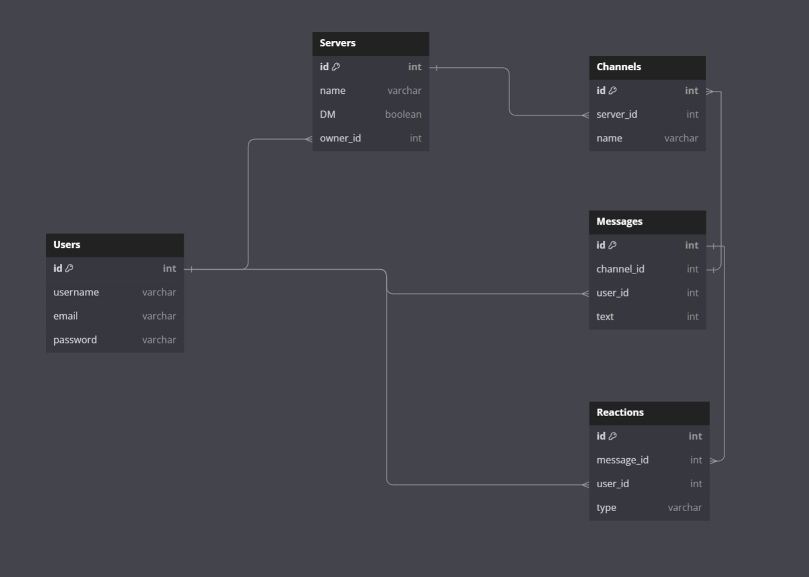

# Flask React Project

This is the starter for the Flask React project.

## Getting started

1. Clone this repository (only this branch).

2. Install dependencies.

   ```bash
   pipenv install -r requirements.txt
   ```

3. Create a __.env__ file based on the example with proper settings for your
   development environment.

4. Make sure the SQLite3 database connection URL is in the __.env__ file.

5. This starter organizes all tables inside the `flask_schema` schema, defined
   by the `SCHEMA` environment variable.  Replace the value for
   `SCHEMA` with a unique name, **making sure you use the snake_case
   convention.**

6. Get into your pipenv, migrate your database, seed your database, and run your
   Flask app:

   ```bash
   pipenv shell
   ```

   ```bash
   flask db upgrade
   ```

   ```bash
   flask seed all
   ```

   ```bash
   flask run
   ```

7. The React frontend has no styling applied. Copy the __.css__ files from your
   Authenticate Me project into the corresponding locations in the
   __react-vite__ folder to give your project a unique look.

8. To run the React frontend in development, `cd` into the __react-vite__
   directory and run `npm i` to install dependencies. Next, run `npm run build`
   to create the `dist` folder. The starter has modified the `npm run build`
   command to include the `--watch` flag. This flag will rebuild the __dist__
   folder whenever you change your code, keeping the production version up to
   date.

## Deployment through Render.com

First, recall that Vite is a development dependency, so it will not be used in
production. This means that you must already have the __dist__ folder located in
the root of your __react-vite__ folder when you push to GitHub. This __dist__
folder contains your React code and all necessary dependencies minified and
bundled into a smaller footprint, ready to be served from your Python API.

Begin deployment by running `npm run build` in your __react-vite__ folder and
pushing any changes to GitHub.

Refer to your Render.com deployment articles for more detailed instructions
about getting started with [Render.com], creating a production database, and
deployment debugging tips.

From the Render [Dashboard], click on the "New +" button in the navigation bar,
and click on "Web Service" to create the application that will be deployed.

Select that you want to "Build and deploy from a Git repository" and click
"Next". On the next page, find the name of the application repo you want to
deploy and click the "Connect" button to the right of the name.

Now you need to fill out the form to configure your app. Most of the setup will
be handled by the __Dockerfile__, but you do need to fill in a few fields.

Start by giving your application a name.

Make sure the Region is set to the location closest to you, the Branch is set to
"main", and Runtime is set to "Docker". You can leave the Root Directory field
blank. (By default, Render will run commands from the root directory.)

Select "Free" as your Instance Type.

### Add environment variables

In the development environment, you have been securing your environment
variables in a __.env__ file, which has been removed from source control (i.e.,
the file is gitignored). In this step, you will need to input the keys and
values for the environment variables you need for production into the Render
GUI.

Add the following keys and values in the Render GUI form:

- SECRET_KEY (click "Generate" to generate a secure secret for production)
- FLASK_ENV production
- FLASK_APP app
- SCHEMA (your unique schema name, in snake_case)

In a new tab, navigate to your dashboard and click on your Postgres database
instance.

Add the following keys and values:

- DATABASE_URL (copy value from the **External Database URL** field)

**Note:** Add any other keys and values that may be present in your local
__.env__ file. As you work to further develop your project, you may need to add
more environment variables to your local __.env__ file. Make sure you add these
environment variables to the Render GUI as well for the next deployment.

### Deploy

Now you are finally ready to deploy! Click "Create Web Service" to deploy your
project. The deployment process will likely take about 10-15 minutes if
everything works as expected. You can monitor the logs to see your Dockerfile
commands being executed and any errors that occur.

When deployment is complete, open your deployed site and check to see that you
have successfully deployed your Flask application to Render! You can find the
URL for your site just below the name of the Web Service at the top of the page.

**Note:** By default, Render will set Auto-Deploy for your project to true. This
setting will cause Render to re-deploy your application every time you push to
main, always keeping it up to date.

[Render.com]: https://render.com/
[Dashboard]: https://dashboard.render.com/
# group-project

# TBD

## Database Schema Design


## API Documentation

## USER AUTHENTICATION/AUTHORIZATION

### All endpoints that require authentication

All endpoints that require a current user to be logged in.

* Request: endpoints that require authentication
* Error Response: Require authentication
  * Status Code: 401
  * Headers:
    * Content-Type: application/json
  * Body:

    ```json
    {
      "message": "Authentication required"
    }
    ```

### All endpoints that require proper authorization

All endpoints that require authentication and the current user does not have the
correct role(s) or permission(s).

* Request: endpoints that require proper authorization
* Error Response: Require proper authorization
  * Status Code: 403
  * Headers:
    * Content-Type: application/json
  * Body:

    ```json
    {
      "message": "Forbidden"
    }
    ```

### Get the Current User

Returns the information about the current user that is logged in.

* Require Authentication: false
* Request
  * Method: GET
  * URL: /api/session
  * Body: none

* Successful Response when there is a logged in user
  * Status Code: 200
  * Headers:
    * Content-Type: application/json
  * Body:

    ```json
    {
      "user": {
        "id": 1,
        "firstName": "John",
        "lastName": "Smith",
        "email": "john.smith@gmail.com",
        "username": "JohnSmith"
      }
    }
    ```

* Successful Response when there is no logged in user
  * Status Code: 200
  * Headers:
    * Content-Type: application/json
  * Body:

    ```json
    {
      "user": null
    }
    ```

### Log In a User

Logs in a current user with valid credentials and returns the current user's
information.

* Require Authentication: false
* Request
  * Method: POST
  * URL: /api/session
  * Headers:
    * Content-Type: application/json
  * Body:

    ```json
    {
      "credential": "john.smith@gmail.com",
      "password": "secret password"
    }
    ```

* Successful Response
  * Status Code: 200
  * Headers:
    * Content-Type: application/json
  * Body:

    ```json
    {
      "user": {
        "id": 1,
        "firstName": "John",
        "lastName": "Smith",
        "email": "john.smith@gmail.com",
        "username": "JohnSmith"
      }
    }
    ```

* Error Response: Invalid credentials
  * Status Code: 401
  * Headers:
    * Content-Type: application/json
  * Body:

    ```json
    {
      "message": "Invalid credentials"
    }
    ```

* Error response: Body validation errors
  * Status Code: 400
  * Headers:
    * Content-Type: application/json
  * Body:

    ```json
    {
      "message": "Bad Request", // (or "Validation error" if generated by WTForms),
      "errors": {
        "credential": "Email or username is required",
        "password": "Password is required"
      }
    }
    ```

### Sign Up a User

Creates a new user, logs them in as the current user, and returns the current
user's information.

* Require Authentication: false
* Request
  * Method: POST
  * URL: /api/users
  * Headers:
    * Content-Type: application/json
  * Body:

    ```json
    {
      "firstName": "John",
      "lastName": "Smith",
      "email": "john.smith@gmail.com",
      "username": "JohnSmith",
      "password": "secret password"
    }
    ```

* Successful Response
  * Status Code: 200
  * Headers:
    * Content-Type: application/json
  * Body:

    ```json
    {
      "user": {
        "id": 1,
        "firstName": "John",
        "lastName": "Smith",
        "email": "john.smith@gmail.com",
        "username": "JohnSmith"
      }
    }
    ```

* Error response: User already exists with the specified email
  * Status Code: 500
  * Headers:
    * Content-Type: application/json
  * Body:

    ```json
    {
      "message": "User already exists",
      "errors": {
        "email": "User with that email already exists"
      }
    }
    ```

* Error response: User already exists with the specified username
  * Status Code: 500
  * Headers:
    * Content-Type: application/json
  * Body:

    ```json
    {
      "message": "User already exists",
      "errors": {
        "username": "User with that username already exists"
      }
    }
    ```

* Error response: Body validation errors
  * Status Code: 400
  * Headers:
    * Content-Type: application/json
  * Body:

    ```json
    {
      "message": "Bad Request", // (or "Validation error" if generated by WTForms),
      "errors": {
        "email": "Invalid email",
        "username": "Username is required",
        "firstName": "First Name is required",
        "lastName": "Last Name is required"
      }
    }
    ```

## SERVERS

### Get all Servers

Returns all the Servers.

* Require Authentication: false
* Request
  * Method: GET
  * URL: /api/servers
  * Body: none

* Successful Response
  * Status Code: 200
  * Headers:
    * Content-Type: application/json
  * Body:

    ```json
    {
      "Servers": [
        {
          "id": 1,
          "ownerId": 1,
          "name": "My Server",
          "DM": False
        }
      ]
    }
    ```

### Get all Servers owned by the Current User

Returns all the servers owned (created) by the current user.

* Require Authentication: true
* Request
  * Method: GET
  * URL: /api/servers/current
  * Body: none

* Successful Response
  * Status Code: 200
  * Headers:
    * Content-Type: application/json
  * Body:

    ```json
    {
      "Servers": [
        {
          "id": 1,
          "ownerId": 1,
          "name": "My Server",
          "DM": False,
        }
      ]
    }
    ```

### Get details of a Server from an id

Returns the details of a server specified by its id.

* Require Authentication: false
* Request
  * Method: GET
  * URL: /api/severs/:server_id
  * Body: none

* Successful Response
  * Status Code: 200
  * Headers:
    * Content-Type: application/json
  * Body:

    ```json
    {
      "id": 1,
      "owner_id": 1,
      "name": "My Server",
      "DM": False,
      "Channels": [
        {
          "id": 1,
          "server_id": 1,
          "name": "Cool Channel"
        },
        {
          "id": 2,
          "server_id": 1,
          "name": "Cool Channel2"
        }
      ],
      "Messages": [
        {
          "id": 1,
          "channel_id": 1,
          "user_id": 1,
          "text": "asdfasdf"
        },
        {
          "id": 2,
          "channel_id": 1,
          "user_id": 2,
          "text": "asdfasdf"
        }
      ],
      "Reactions": [
        {
          "id": 1,
          "message_id": 2,
          "user_id": 2,
          "type": "thumbsup"
        },
        {
          "id": 2,
          "message_id": 2,
          "user_id": 3,
          "type": "thumbsup"
        }
      ],
    }
    ```

* Error response: Couldn't find a Server with the specified id
  * Status Code: 404
  * Headers:
    * Content-Type: application/json
  * Body:

    ```json
    {
      "message": "Server couldn't be found"
    }
    ```

### Create a Server

Creates and returns a new server.

* Require Authentication: true
* Request
  * Method: POST
  * URL: /api/servers
  * Headers:
    * Content-Type: application/json
  * Body:

    ```json
    {
      "owner_id": 1,
      "name": "My Server"
    }
    ```

* Successful Response
  * Status Code: 201
  * Headers:
    * Content-Type: application/json
  * Body:

    ```json
    {
      "id": 1,
      "owner_id": 1,
      "name": "My Server",
      "createdAt": "2021-11-19 20:39:36",
      "updatedAt": "2021-11-19 20:39:36"
    }
    ```

* Error Response: Body validation errors
  * Status Code: 400
  * Headers:
    * Content-Type: application/json
  * Body:

    ```json
    {
      "message": "Bad Request", // (or "Validation error" if generated by WTForms),
      "errors": {
        "name": "Name is required"
      }
    }
    ```


### Edit a Server

Updates and returns an existing server.

* Require Authentication: true
* Require proper authorization: Server must belong to the current user
* Request
  * Method: PUT
  * URL: /api/servers/:server_id
  * Headers:
    * Content-Type: application/json
  * Body:

    ```json
    {
      "name": "New Server Name"
    }
    ```

* Successful Response
  * Status Code: 200
  * Headers:
    * Content-Type: application/json
  * Body:

    ```json
    {
      "id": 1,
      "owner_id": 1,
      "name": "New Server Name",
      "createdAt": "2021-11-19 20:39:36",
      "updatedAt": "2021-11-19 20:39:36"
    }
    ```

* Error Response: Body validation errors
  * Status Code: 400
  * Headers:
    * Content-Type: application/json
  * Body:

    ```json
    {
      "message": "Bad Request", // (or "Validation error" if generated by WTForms),
      "errors": {
        "name": "Name is required",
      }
    }
    ```

* Error response: Couldn't find a Server with the specified id
  * Status Code: 404
  * Headers:
    * Content-Type: application/json
  * Body:

    ```json
    {
      "message": "Server couldn't be found"
    }
    ```


### Delete a Server

Deletes an existing server.

* Require Authentication: true
* Require proper authorization: Server must belong to the current user
* Request
  * Method: DELETE
  * URL: /api/server/:server_id
  * Body: none

* Successful Response
  * Status Code: 200
  * Headers:
    * Content-Type: application/json
  * Body:

    ```json
    {
      "message": "Successfully deleted"
    }
    ```

* Error response: Couldn't find a Server with the specified id
  * Status Code: 404
  * Headers:
    * Content-Type: application/json
  * Body:

    ```json
    {
      "message": "Server couldn't be found"
    }
    ```

## CHANNELS

### Get a Channel by Channel Id

Returns the details of a channel specified by its id.

* Require Authentication: false
* Request
  * Method: GET
  * URL: /api/channels/:channel_id
  * Body: none

* Successful Response
  * Status Code: 200
  * Headers:
    * Content-Type: application/json
  * Body:

    ```json
    {
      "id": 1,
      "server_id": 1,
      "name": "General Chat"
    }
    ```

* Error response: Couldn't find a Channel with the specified id
  * Status Code: 404
  * Headers:
    * Content-Type: application/json
  * Body:

    ```json
    {
      "message": "Channel couldn't be found"
    }
    ```

### Create a Channel

Creates and returns a new channel.

* Require Authentication: true
* Request
  * Method: POST
  * URL: /api/channels
  * Headers:
    * Content-Type: application/json
  * Body:

    ```json
    {
      "server_id": 1,
      "name": "Degen Chat"
    }
    ```

* Successful Response
  * Status Code: 201
  * Headers:
    * Content-Type: application/json
  * Body:

    ```json
    {
      "id": 1,
      "server_id": 1,
      "name": "Degen Chat",
      "createdAt": "2021-11-19 20:39:36",
      "updatedAt": "2021-11-19 20:39:36"
    }
    ```

* Error Response: Body validation errors
  * Status Code: 400
  * Headers:
    * Content-Type: application/json
  * Body:

    ```json
    {
      "message": "Bad Request", // (or "Validation error" if generated by WTForms),
      "errors": {
        "name": "Name is required"
      }
    }
    ```


### Delete a Channel

Delete an existing channel.

* Require Authentication: true
* Require proper authorization: Server must belong to the current user
* Request
  * Method: DELETE
  * URL: /api/channels/:channel_id
  * Body: none

* Successful Response
  * Status Code: 200
  * Headers:
    * Content-Type: application/json
  * Body:

    ```json
    {
      "message": "Successfully deleted"
    }
    ```

* Error response: Couldn't find a Review with the specified id
  * Status Code: 404
  * Headers:
    * Content-Type: application/json
  * Body:

    ```json
    {
      "message": "Channel couldn't be found"
    }
    ```

## MESSAGES

### Get all Messages for a Channel based on the Channel's id

Return all the messages for a channel specified by id.

* Require Authentication: true
* Request
  * Method: GET
  * URL: /api/channels/:channel_id/messages
  * Body: none

* Successful Response:
  * Status Code: 200
  * Headers:
    * Content-Type: application/json
  * Body:

    ```json
    {
      "Messages": [
        {
          "User": {
            "id": 2,
            "username": "User 1"
          },
          "id": 1,
          "channel_id": 1,
          "text": "I like bananas",
          "createdAt": "2021-11-19 20:39:36",
          "updatedAt": "2021-11-19 20:39:36"
        }
      ]
    }
    ```

* Error response: Couldn't find a Channel with the specified id
  * Status Code: 404
  * Headers:
    * Content-Type: application/json
  * Body:

    ```json
    {
      "message": "Channel couldn't be found"
    }
    ```

### Create a Message in a Channel based on Channel's id

Create and return a new message for a channel specified by id.

* Require Authentication: true
* Request
  * Method: POST
  * URL: /api/channels/:channel_id/messages
  * Headers:
    * Content-Type: application/json
  * Body:

    ```json
    {
      "text": "hello everyone!"
    }
    ```

* Successful Response
  * Status Code: 200
  * Headers:
    * Content-Type: application/json
  * Body:

    ```json
    {
      "id": 1,
      "user_id": 1,
      "text": "hello everyone!",
      "createdAt": "2021-11-19 20:39:36",
      "updatedAt": "2021-11-19 20:39:36"
    }
    ```

* Error response: Body validation errors
  * Status Code: 400
  * Headers:
    * Content-Type: application/json
  * Body:

    ```json
    {
      "message": "Bad Request", // (or "Validation error" if generated by WTForms),
      "errors": {
        "text": "Text is required"
      }
    }
    ```

* Error response: Couldn't find a Channel with the specified id
  * Status Code: 404
  * Headers:
    * Content-Type: application/json
  * Body:

    ```json
    {
      "message": "Channel couldn't be found"
    }
    ```

### Edit a Message

Update and return an existing message.

* Require Authentication: true
* Require proper authorization: Message must belong to the current user
* Request
  * Method: POST
  * URL: /api/messages/:message_id
  * Headers:
    * Content-Type: application/json
  * Body:

    ```json
    {
      "text": "Goodbye everyone!"
    }
    ```

* Successful Response
  * Status Code: 200
  * Headers:
    * Content-Type: application/json
  * Body:

    ```json
    {
      "id": 1,
      "channel_id": 1,
      "user_id": 1,
      "text": "Goodbye everyone!",
      "createdAt": "2021-11-19 20:39:36",
      "updatedAt": "2021-11-20 10:06:40"
    }
    ```

* Error response: Body validation errors
  * Status Code: 400
  * Headers:
    * Content-Type: application/json
  * Body:

    ```json
    {
      "message": "Bad Request", // (or "Validation error" if generated by WTForms),
      "errors": {
        "text": "Text is required"
      }
    }
    ```

* Error response: Couldn't find a Message with the specified id
  * Status Code: 404
  * Headers:
    * Content-Type: application/json
  * Body:

    ```json
    {
      "message": "Message couldn't be found"
    }
    ```


### Delete a Message

Delete an existing message.

* Require Authentication: true
* Require proper authorization: Message must belong to the current user or the
  Server must belong to the current user
* Request
  * Method: DELETE
  * URL: /api/messages/:messageId
  * Body: none

* Successful Response
  * Status Code: 200
  * Headers:
    * Content-Type: application/json
  * Body:

    ```json
    {
      "message": "Successfully deleted"
    }
    ```

* Error response: Couldn't find a Message with the specified id
  * Status Code: 404
  * Headers:
    * Content-Type: application/json
  * Body:

    ```json
    {
      "message": "Message couldn't be found"
    }
    ```

## REACTIONS

### Create a Reaction on a Message based on Message's id

Create and return a new reaction for a message specified by id.

* Require Authentication: true
* Request
  * Method: POST
  * URL: /api/reactions/:reaction_id
  * Headers:
    * Content-Type: application/json
  * Body:

    ```json
    {
      "type": "thumbsup"
    }
    ```

* Successful Response
  * Status Code: 200
  * Headers:
    * Content-Type: application/json
  * Body:

    ```json
    {
      "id": 1,
      "user_id": 1,
      "message_id": 1,
      "type": "thumbsup",
      "createdAt": "2021-11-19 20:39:36",
      "updatedAt": "2021-11-19 20:39:36"
    }
    ```

* Error response: Couldn't find a Message with the specified id
  * Status Code: 404
  * Headers:
    * Content-Type: application/json
  * Body:

    ```json
    {
      "message": "Message couldn't be found"
    }
    ```

### Delete a Reaction

Delete an existing reaction for a message.

* Require Authentication: true
* Require proper authorization: Spot must belong to the current user
* Request
  * Method: DELETE
  * URL: /api/reactions/:reaction_id
  * Body: none

* Successful Response
  * Status Code: 200
  * Headers:
    * Content-Type: application/json
  * Body:

    ```json
    {
      "message": "Successfully deleted"
    }
    ```

* Error response: Couldn't find a message with the specified id
  * Status Code: 404
  * Headers:
    * Content-Type: application/json
  * Body:

    ```json
    {
      "message": "Message couldn't be found"
    }
    ```


### User Stories

## Create a User

  * Users can create new accounts by clicking the Sign Up button.
  * A username, email, and secure password are required for all user accounts.
  * Successfully creating a user account will redirect to the All Servers page.

## Log in

  * If there is no currently signed-in user account, the Log In page will be displayed.
  * To log in, users must enter either their username or email along with the password for their account.
  * Successfully signing in will redirect to the All Servers page.

## Servers
  *  Users should be able to view all publicly created servers.
  *  Users should be able to create new servers.
  *  Users should be able to update servers they created.
  *  Successfully creating/updating a server will redirect to the new server's page.
  *  Users should be able to delete servers they created.
  *  Successfully deleting a server will redirect to the All Servers page.

## Channels
  *  Users should be able to view all public channels in a server.
  *  Users should be able to create new channels in a server they own.
  *  Users should be able to update channels they created.
  *  Users should be able to delete channels they created.

## Messages
  *  Users should be able to view all messages in a channel.
  *  Users should be able to create new messages.
  *  Users should be able to update messages they sent.
  *  Users should be able to delete messages they sent.

## Reactions
  *  Users should be able to view all reactions on a message.
  *  Users should be able to add reactions to a message.
  *  Users should be able to remove their reaction(s) from a message.

## Bonus: Threads
  *  Users should be able to view all threads within a channel.
  *  Users should be able to create a thread off of a message.

## Bonus: Direct Messages
  *  Users should be able to view all direct messages between them and another user.
  *  Users should be able to create new direct messages.
  *  Users should be able to update messages they sent.
  *  Users should be able to delete messages they sent.
